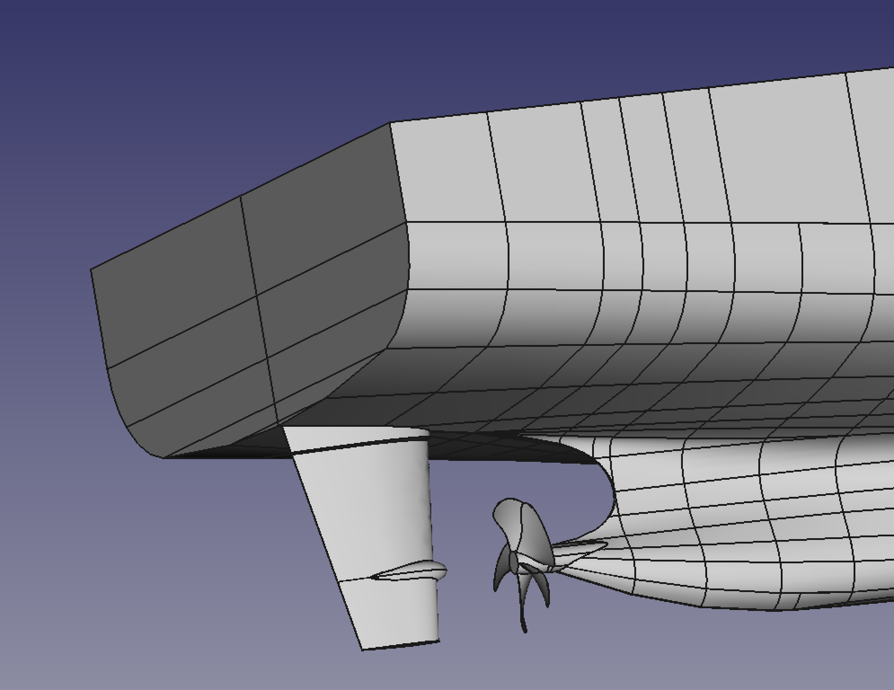
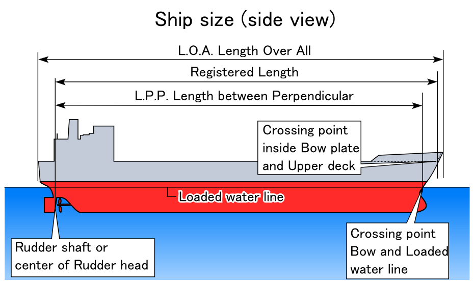
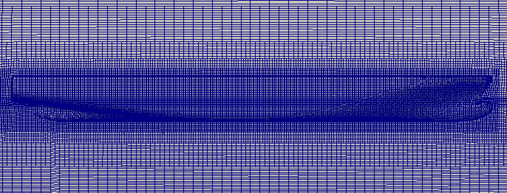

# OpenFOAM for ship hydrodynamics 講習会

<div style="text-align: right;">
2017.09.16 yotakagi77
</div>

## はじめに

この資料は2017年9月16日に行われた"OpenFOAM for ship dydrodynamics講習会"用に書かれたものである．内容は船舶CFDを始めようとする方，または流体解析の経験があって船舶CFDに興味がある方を対象とした内容となっている．流体解析そのものはオープンソースソフトウェアのOpenFOAMを用いて行うが，OpenFOAMの基本的な使い方(チュートリアルケースの実行の仕方，ケースファイルの構成，ParaViewによる可視化，etc)は習得していることを前提する．OpenFOAMをまだ一度も使ったことがない方は，本資料を用いて演習を行う前に，公式のOpenFOAMユーザガイドや『OpenFOAMによる熱移動と流れの数値解析』を読んで自習されることをおすすめする．

## 水槽試験

船型設計においてCFDは欠かせないものとなっているが，最終的には水槽試験を行うのが通常であり，CFD解析も各種水槽試験に準拠して行うのが普通である．そのため，CFDだけを行う・興味がある場合でも，各種水槽試験に関する基礎的な知識を持っていることが重要である．実海域での実船試験は限定されるため，通常は模型船を用いて各機関が保有する水槽で試験を行う．よく行われる水槽試験としては以下のものがあげられる．

* 抵抗試験 (Resistance)
* 自航試験 (Propulsion)
* プロペラ単独性能試験 (Propeller Open water Test, POT)
* キャビテーション試験 (Cavitation)
* 自由横揺れ試験 (Free Rolling)
* PMM試験 (Planer Motion Mechanism)

### ベンチマークテスト

CFDや計測精度の検証のために，各種のベンチマークテストが提案されており，試験された模型船形状，プロペラ形状と共に実施した水槽での試験結果が公開されている．CFDのベンチマークによく利用されている模型船試験としては以下のものなどがあげられる．

* DTC (Duisburg Test Case)
* KCS (KRISO Container Ship)
* KVLCC2
* DTMB 5415
* Wigley

## OpenFOAMでの船舶CFDに対する機能性向上

OpenFOAMの標準チュートリアルでは，バージョン2.2でWigley，バージョン2.3以降でDTCが含まれている．OpenFOAMを用いて船舶CFDを行うニーズは従来から高く，2008年に開催された3rd OpenFOAM WorkshopでShip HydrodynamicsのSIG(Special Interest Group)ができている．しかしながら，OpenFOAMの初期のVOFソルバーでは船体付近での造波予測精度があまりよくなかったことと，計算時間がかかることを理由に，船舶CFDに特化した/強みを持つ商用ソルバーに比較して利用が拡大していなかった．最近ではVOFソルバーの精度改善，及び局所時間ステップ(Local Time Stepping, LTS)導入による計算時間の短縮によって，OpenFOAMで船舶CFDを行う事例が多数報告されている．さらに最近のOpenFOAMでは流入造波機能や重合格子(overset grid)が導入されており，耐航性や複雑船尾形状などの応用的船舶CFDにもOpenFOAMが使用されることが見込まれる．

## DTCHullチュートリアル

### チュートリアルケースのコピー，構成確認

今回のハンズオン講習では，バージョン2.3以降に含まれているDTCHullチュートリアルを取り上げる．まず，OpenFOAMを実行できる端末を起動し，該当するチュートリアルケースを探して自分のrunディレクトリにコピーする．

```bash
$ tut
$ find . -name 'DTCHull*'
$ mkdir -p $FOAM_RUN
$ run
$ cp -r $FOAM_TUTORIALS/multiphase/interDyMFoam/ras/DTCHull ./
$ cd DTCHull
```

ケースディレクトリの構成を確認してみる．GUIの場合は各種ファイラー，CUIの場合は`tree`コマンドを使う(初期状態ではインストールされていないことが多いので注意)．

```bash
$ tree
```
```
.
├── 0.orig
│   ├── U
│   ├── alpha.water
│   ├── k
│   ├── nut
│   ├── omega
│   ├── p_rgh
│   └── pointDisplacement
├── Allclean
├── Allrun
├── README
├── constant
│   ├── dynamicMeshDict
│   ├── dynamicMeshDict.sixDoF
│   ├── g
│   ├── hRef
│   ├── transportProperties
│   ├── triSurface
│   │   └── README
│   └── turbulenceProperties
└── system
    ├── blockMeshDict
    ├── controlDict
    ├── decomposeParDict
    ├── fvSchemes
    ├── fvSolution
    ├── meshQualityDict
    ├── refineMeshDict
    ├── setFieldsDict
    ├── snappyHexMeshDict
    ├── surfaceFeatureExtractDict
    ├── topoSetDict.1
    ├── topoSetDict.2
    ├── topoSetDict.3
    ├── topoSetDict.4
    ├── topoSetDict.5
    └── topoSetDict.6
```

まず`README`が置いてあることに気づくので，中身を確認する．

```bash
$ cat README
```

```
Reference:
Duisburg Test Case (DTC)
el Moctar, O., Shigunov, V., Zorn, T.,
Duisburg Test Case: Post-Panamax Container Ship for Benchmarking,
Journal of Ship Technology Research,
Vol.59, No.3, pp. 50-65, 2012
```

参考文献が一つ書かれているだけであるが，DTCHullチュートリアルはこの論文をベースにしていることを示している．該当論文はインターネットからPDFとしてダウンロードできるので，船舶CFDに本格的に取り組みたい方は中身を精読されたい．論文の構成(章立て)は以下のようになっている．

1. Introduction

2. Geometry and Main Particulars

3. Resistance and Propulsion Tests

    3.1 Loading Conditions

    3.2 Open-Water Propeller Tests

    3.3 Resistance Tests

    3.4 Propulsion Tests

4. Roll Damping Tests

    4.1 Loading Conditions

    4.2 Roll Damping Measurements according to Blume (1979)

    4.3 Roll Decay Tests

5. Example of Numerical Results

    5.1 Resistance

    5.2 Roll Decay

6. References

この論文の水槽試験としては，プロペラ単独性能試験(Open-Water Propeller Tests)，抵抗試験(Resistance Tests)，自航試験(Propulsion Tests)，揺れ減衰試験(Roll Damping Tests)を実施しており，RANSE-CFDコードによる計算結果と実験結果の比較を行っている．今回のハンズオン講習では，船形状・主要目を確認した後に抵抗試験のみに注目して進める．

### 船形状の確認

DTCベンチマークはInstitute of Ship Technology, Ocean Engineering and Transport Systems (ISMT)が試験を行っているが，船のCADデータは[ISMTのウェブサイト](http://www.uni-due.de/ISMT/)に行き，"PUBLICATIONS"-"Duisburg Test Case"-"CAD data"からダウンロードできる．ダウンロードしてzipファイルを解凍すると，以下の5つのIGESファイルが入手できる．

* DTC_Prop.igs		
* DTC_bilge_keel.igs
* DTC_gap_hull_prop.igs
* DTC_hull.igs
* DTC_trimmed_rudder.igs

上から順に，プロペラ，ビルジキール，船体-プロペラ間のギャップ，船体(船殻)，舵である．IGES形式なので，一般的なCADソフトや3DCGで読み込むことができる．例えば，FreeCADで全てのIGESファイルを読み込んで船尾を拡大したものをFig. 1に示す．

<center>
<br>

**Fig. 1 Ship stern with rudder and propeller**
</center>

ここで描画したものは船体に付属するプロペラ，ビルジキール，舵を含んでいるが，抵抗試験では平水中を曳航(直進)するだけなので，`DTC_hull.igs`のみから船形状を定義し，計算格子を作成する．今回のチュートリアルケースでは`$FOAM_TUTORIALS/resources/geometry/DTC-scaled.stl.gz`に同じ形状のSTLファイルが用意されているので，これを用いて計算格子を作成する．

設計荷重条件におけるモデルスケール，実船フルスケールでの主要目はTable 1に示すとおりである．

<center>

**Table 1 Main dimensions of DTC in design loading condition.**

|                 | Model | Full Scale |
|:----------------|:-----:|:----------:|
| $L_{pp}$ [m]    | 5.976 |   355.0    |
| $B_{wl}$ [m]    | 0.859 |    51.0    |
| $T_m$ [m]       | 0.244 |    14.5    |
| $\theta$ [$^o$] |  0.0  |    0.0     |
| $V$ [m $^3$]    | 0.827 |  173467.0  |
| $C_B$ [-]       | 0.661 |   0.661    |
| $S_W$ [m $^2$]  | 6.243 |  22032.0   |
| $v_d$ [knots]   | 3.244 |    25.0    |

</center>

ここで，$L_{pp}$ は垂線間長さ(length between perpendiculars)，水線幅(water line breadth)，$T_m$は中央部喫水(draught midships)，$\theta$はトリム(trim angle)，$V$は排水容積(volume displacement)，$C_B$は方形肥痩係数(block coefficient)，$S_W$は付加物なしでの浸水表面積(wetted surface)，$v_d$は設計速度(design speed)である．垂線と長さの関係はFig. 2に示すとおりであり，$L_{pp}$ が設計でよく使われる．

<center>
<br>

**Fig. 2 Ship size and length. [引用元:Wikipedia](https://en.wikipedia.org/wiki/Length_between_perpendiculars)**
</center>

### 抵抗試験

実船フルスケールでの船の長さと速度が与えられたので，船舶工学において重要な無次元数であるフルード数(Froude number)を求めてみる．$v_d$ = 25 notsの場合，定義式より，

$$
  Fr = \frac{v}{\sqrt{gL_{pp}}}=\frac{25\times 0.51444}{\sqrt{9.80665\times 355}}
     = 0.218
$$

となる．抵抗試験ではフルードの相似則により，実船スケールと同じフルード数で模型船を曳航して造波抵抗係数を求めるので，実船速度が20 ~ 25 knotsの試験の場合，フルード数の定義式から模型船速度$v_M$を求めるとTable 2のようになる．

<center>

**Table 2 Ship velocities and Froude and Reynolds numbers.**

| $v$ [knots] | $v_M$ [m/s] [-] | $Fr$ [-] | $Re\times 10^{-6}$ [-] |
|:-----------:|:---------------:|:--------:|:----------------------:|
|    20.0     |      1.335      |  0.174   |         7.319          |
|    21.0     |      1.401      |  0.183   |         7.681          |
|    22.0     |      1.469      |  0.192   |         8.054          |
|    23.0     |      1.535      |  0.200   |         8.415          |
|    24.0     |      1.602      |  0.209   |         8.783          |
|    25.0     |      1.668      |  0.218   |         9.145          |

</center>

ここで，模型スケールでのレイノルズ数，
$$
  Re = \frac{v_ML_{pp_M}}{\nu_M}
$$
も同時に示してある(水槽試験での水の動粘度は $\nu_M = 1.090\times 10^{-6}$ m $^2$/s)．レイノルズ数もCFDにおいて重要なパラメータであるが，フルード数とともに実船と同じ値に設定することは無理であるため，レイノルズ数効果を検証したい場合は，試験結果との相関が取れたCFDを実船スケールに拡張して行う必要がある．

水槽試験では模型船は水槽上の台車に取り付けられて設定された速度$v_M$で曳航され，模型船に働く力が分力計によって測定される．この船に働く全抵抗は，

全抵抗 = 摩擦抵抗 + 形状抵抗 + 造波抵抗 + 空気抵抗 = 粘性抵抗 + 造波抵抗 + 空気抵抗

に分けて考えることができる．平水中で行われる曳航試験では空気抵抗の寄与は無視できるので，

全抵抗(水抵抗) = 摩擦抵抗 + 形状抵抗 + 造波抵抗 = 粘性抵抗 + 造波抵抗

となる．形状抵抗と造波抵抗を併せて剰余抵抗と呼ぶことがあり，その場合は，

全抵抗(水抵抗) = 摩擦抵抗 + 剰余抵抗

となる．全抵抗を$R_T$[N]，摩擦抵抗を$R_F$[N]，造波抵抗を$R_W$とし，対応する全抵抗係数，摩擦抵抗係数，造波抵抗係数をそれぞれ$C_T$，$C_F$，$C_W$とすると，

$$
  C_T = \frac{R_T}{\frac{1}{2}\rho S_W v^2}
$$

$$
  C_F = \frac{R_F}{\frac{1}{2}\rho S_W v^2}
$$

$$
  C_W = \frac{R_W}{\frac{1}{2}\rho S_W v^2}
$$
摩擦抵抗に関しては，船舶工学では浸水面積と等しい面積を持つ平板(相当平板)に働く摩擦抵抗から$C_F$を推定するのが基本的な考え方であり，$C_F$の推算式がいくつかある．今回の論文では，ITTC 1957の式，

$$
  C_F = \frac{0.075}{(\log_{10}Re - 2.0)^2}
$$

を用いて$C_F$を算出している．実際の船形は三次元形状であるから，相当平板に対してのずれの割合を形状係数(form factor) $K$ とし，

$$
  C_T = (1+K)C_F + C_W
$$

の関係になる．この$K$の推算方法も種々提案されているが，今回の論文では自由表面が存在しない二重模型流れ(double-body flow)のCFD計算から求めた$K = 0.094$を用いている．測定された$R_T$から$C_T$が計算され，$C_F$及び$K$が推算されたので，残りの造波抵抗係数は上式より，
$$
  C_W = C_T - (1+K) C_F
$$
と求められる．このような一連の整理方法で模型船抵抗試験の結果をまとめたものがTable 3である．

<center>

**Table 3 Results of resistance model tests.**

| $v_M$ [m/s] [-] | $Fr$ [-] | $Re\times 10^{-6}$ [-] | $R_T$ [N] | $R_F$ [N] | $C_T\times 10^3$ [-] | $C_F\times 10^3$ [-] | $C_W\times 10^4$ [-] |
|:---------------:|:--------:|:----------------------:|:---------:|:---------:|:--------------------:|:--------------------:|:--------------------:|
|      1.335      |  0.174   |         7.319          |   20.34   |  17.611   |        3.661         |        3.170         |        1.932         |
|      1.401      |  0.183   |         7.681          |   22.06   |  19.229   |        3.605         |        3.142         |        1.672         |
|      1.469      |  0.192   |         8.054          |   24.14   |  20.964   |        3.588         |        3.116         |        1.791         |
|      1.535      |  0.200   |         8.415          |   26.46   |  22.713   |        3.602         |        3.092         |        2.194         |
|      1.602      |  0.209   |         8.783          |   28.99   |  24.554   |        3.623         |        3.069         |        2.660         |
|      1.668      |  0.218   |         9.145          |   31.83   |  26.431   |        3.670         |        3.047         |        3.360         |

</center>

### CFDによる各抵抗成分の算出

CFDによる解析結果から，上記の各抵抗成分及び抵抗係数の算出を考えてみる．通常の流体解析では速度と圧力を解くわけであるから，出力として船体表面での粘性摩擦抵抗$R_F$と圧力抵抗$R_P$が得られる．すなわち，

$$
  R_T = R_F + R_P
$$

である．圧力抵抗は造波抵抗$R_W$と粘性圧力抵抗$R_{VP}$ を含んでおり，すなわち，

$$
  R_P = R_{VP} + R_W
$$

であるから，全抵抗はさらに

$$
  R_T = R_F + R_{VP} + R_W
$$

と分けられる．粘性圧力抵抗は物体形状によって変わるものなので，相当平板の考え方を用いて摩擦抵抗に比例すると考えると，

$$
  R_{VP} = KR_F
$$

とおくことができ，上式に代入すると，

$$
  R_T = (1+K)R_F + R_W
$$

となる．通常，水槽試験との相関を考えて，平板での摩擦抵抗係数を$C_{f0}$ とすると，$1+K$は，
$$
  1+K = \frac{C_T}{C_{f0}}
$$
と求まる．

###　自由表面付き流れの解析

もう一度OpenFOAMのチュートリアルケースの種類を確認してみる．

```bash
$ tut
$ find . -name 'DTCHull*'
```
```
./multiphase/interDyMFoam/ras/DTCHull
./multiphase/interFoam/ras/DTCHull
```

OpenFOAMのチュートリアルは各ソルバーごとに分類されているが，`interFoam`と`interDyMFoam`それぞれにDTCHullチュートリアルがあることがわかる．`interDyMFoam`は物体の6自由度運動による移動格子計算が可能であるが，水槽試験との関連性では，

* interFoam: 姿勢固定(船体が一定の高さに固定されている)
* interDymFoam: 姿勢自由 (船体が上下に動ける)

として捉えることができ，今回の論文の抵抗試験では後者の姿勢自由(free in trim and sinkage)条件で行なっているのでinterDymFoamで演習を進める．なお，$1+K$を求めるためには造波がない平板周り流れの解析が必要であるが，OpenFOAMの標準チュートリアルには該当ケースが用意されていない．

#### Allrunスクリプト

OpenFOAMでのCFDの解析手順を確認するために，格子生成からソルバー実行までは自動で行えるスクリプト`Allrun`の中身を確認してみる．

```bash
$ run
$ cd DTCHull
$ less Allrun
```
(前半部分)
```
#!/bin/sh
cd ${0%/*} || exit 1    # Run from this directory

# Source tutorial run functions
. $WM_PROJECT_DIR/bin/tools/RunFunctions

# copy DTC hull surface from resources folder
cp $FOAM_TUTORIALS/resources/geometry/DTC-scaled.stl.gz constant/triSurface/

runApplication surfaceFeatureExtract

runApplication blockMesh

for i in 1 2 3 4 5 6
do
    runApplication -s $i \
        topoSet -dict system/topoSetDict.${i}

    runApplication -s $i \
        refineMesh -dict system/refineMeshDict -overwrite
done

runApplication snappyHexMesh -overwrite
```

スクリプトの前半部分では，模型船の形状データであるSTLファイルをコピーし，snappyHexMeshに必要となる特徴線の抽出(`surfaceFeatureExtract`)を実行した後，ベースメッシュの作成(`blockMesh`)，細分化が必要な領域の作成・メッシュ細分化を6つの領域に対して行い，`snappyHexMesh`で最終格子を作成している．`snappyHexMesh`は設定項目が多く品質が良い格子の作成にはノウハウが必要なので，その他の使い慣れたメッシャーがあれば別途作成したメッシュをインポートしてもよい．

(後半部分)
```
rm -rf 0
cp -r 0.orig 0

runApplication setFields

runApplication decomposePar

runParallel renumberMesh -overwrite

runParallel $(getApplication)

runApplication reconstructPar
```

後半部分では，`0.orig`をコピーして初期条件・境界条件が記述された`0`ディレクトリを作成し，`setFields`でVOF関数`alpha.water`の初期条件を設定して初期水位を与えた後，ソルバーを並列計算で実行するための一連のコマンド(`decomposePar`，`renumberMesh`，`$(getApplication)`(=`interDyMFoam`)，`reconstructPar`)を実行している．

#### 格子生成

今回のDTCHullチュートリアルはソルバー本体の計算時間がかかるため，前半部分のメッシュの作成のみ実施してみる．`Allrun`スクリプトの前半をコピーして`Allrun.pre`とし実行してみる．

```bash
$ cp Allrun Allrun.pre
$ vi Allrun.pre # 前半部分のみを残して保存する
$ ./Allrun.pre &
```
`snappyHexMesh`まで実行が完了したら，ParaViewを使って船体形状，計算格子を確認してみる．

```bash
$ paraFoam &
```

ParaViewが起動したら，以下の手順で船体表面及び近傍の計算格子を表示する．

1. "Properties"の"Mesh Parts"で，"internalMesh"をアンチェックし，"hull - patch"のみチェックする．
2. "Edit Axes Grid ..."の左側マスにチェックを入れる．
3. "Apply"をクリックする．
4. マウスで回転させて視点を変えてみる．
5. "Set view direction to +Y"をクリックして視点を船側にする．原点位置(特に$x=0$，AP)を確認する．
6. Coloringを"Solid Color"に変更し，表示方法を"Surface With Edges"に変更する．
7. "Mesh Parts"で"midPlane - patch"にチェックを追加する．
8. "Apply"をクリックする．船首・船尾付近を拡大して境界層メッシュを確認する．
9. 必要ならばスクリーンショット及びstateを保存する．

<center>
<br>

**Fig. 2 Computational grid around the hull.**
</center>

ParaViewで確認してわかるとおり，計算領域は$y>0$の領域のみ，すなわち片舷である．プロペラが付いていない抵抗試験の場合は流れが中心線に対して対象となるので片舷計算で良いが，プロペラがある自航試験ではプロペラによる流れが非対称になるので両舷計算が必要となる．

#### 試験条件設定

まず喫水の設定であるが，水面高さはVOF関数`alpha.water`で初期条件として与えるので，`setFields`ユーティリティの設定ファイル`setFieldsDict`の中身を確認する．

```bash
$ less ./system/setFieldsDict
```
```
regions
(
    // Set cell values
    // (does zerogradient on boundaries)
    boxToCell
    {
        box (-999 -999 -999) (999 999 0.244);

        fieldValues
        (
            volScalarFieldValue alpha.water 1
        );
    }

    // Set patch values (using ==)
    boxToFace
    {
        box (-999 -999 -999) (999 999 0.244);

        fieldValues
        (
            volScalarFieldValue alpha.water 1
        );
    }
);
```
`box`で 対角頂点を指定しているが，0.244の$z$座標が喫水$T_m$に対応する．論文と同じ$T_m$ = 0.244 mが設定されているので変更する必要がないが，バラスト状態を変化させた解析を行いたい場合はこの数値を変更する．

次に模型船の速度を確認する．水槽試験は模型船を曳航するが，CFD解析では条件速度の一様流中に模型船を置くことになる．初期条件を与える`0.orig`ディクトリでの速度ファイル`U`を確認する．

```bash
$ less 0.orig/U
```
```
Umean 1.668;
mUmean -1.668;

dimensions      [0 1 -1 0 0 0 0];

internalField   uniform ($mUmean 0 0);
```

`Umean`，`mUmean`に $\pm$ 25 knots = $\pm$ 1.668 m/sが設定されており，論文中での一番早い速度の条件が設定されていることがわかる．一様流の速度は`internalField`で与えられており，船首が $+x$方向を向いているので`mUmean = -1.668`で与えられている．

最後に，6自由度運動の計算に関する設定を確認してみる．運動に伴う移動格子の設定は`dynamicMeshDict`に記述してある．

```
$ less constant/dynamicMeshDict
```
```
dynamicFvMesh       dynamicMotionSolverFvMesh;

motionSolverLibs   ("librigidBodyMeshMotion.so");

solver             rigidBodyMotion;

rigidBodyMotionCoeffs
{
    report          on;

    solver
    {
        type Newmark;
    }

    accelerationRelaxation 0.4;

    bodies
    {
        hull
        {
            type            rigidBody;
            parent          root;

            centreOfMass    (0 0 0);
            mass            412.73;
            inertia         (40 0 0 921 0 921);
            transform       (1 0 0 0 1 0 0 0 1) (2.929541 0 0.2);

            joint
            {
                type    composite;
                joints
                (
                    {
                        type Pz;
                    }
                    {
                        type Ry;
                    }
                );
            }

            patches         (hull);
            innerDistance   0.3;
            outerDistance   1;
        }
    }
    restraints
    {
        translationDamper
        {
            type linearDamper;
            body hull;
            coeff 8596;
        }

        rotationDamper
        {
            type sphericalAngularDamper;
            body hull;
            coeff 11586;
        }
    }
}
```
6自由度運動は設定項目が多く，論文中の抵抗試験の記述では対応する各設定パラメータがわからないので正確に文献から設定値を見積もることは難しい．姿勢自由の抵抗試験なので，412.73 kgの模型船(片舷)が座標(2.929541 0 0.2)の浮体中心で$z$方向の並進移動(`type Pz`)，$y$軸まわりの回転(`type Ry`)のジョイントで支持されていることが読み取れる．バラスト状態を変化させた解析を行いたい場合は模型船重量と浮体中心の$z$座標を変更しなければならない．

#### 数値スキームに関する設定

有限体積法のスキームに関する設定は`fvSchemes`，反復解法については`fvSolution`の設定を確認し，積分時間に関する設定は`controlDict`で変更しなければいけないが，これらの設定は適切な組み合わせで決定・検討しなければいけないのでここでの説明は省略する．

#### 船速を変更させた解析の実行

水槽試験と同様にフルード数に対する抵抗・抵抗係数の依存性を検討するためには，Table 2またはTabl 3に示したように6つの船速で解析を実施する必要がある．オリジナルのチュートリアルケースは船速が一番早い条件$v_M$ = 1.668 m/sであったので，格子解像度を変更する必要はなく，これをそのままコピーして`0.orig/U`を書き換えて計算を実行すればよい．6ケースだけなのでマニュアルでコピー・書き換えをしてもよいし，`run`ディレクトリ直下にシェルスクリプトを自作して，自動でパラメトリックに解析してもよい．

### 後処理・可視化

#### 抵抗値

計算を実行すると，`postProcessing`ディレクトリに抵抗値の時系列データが出力される．出力データの形式を確認する．

```bash
$ head -n 5 postProcessing/forces/0/forces.dat
```
```
# Forces     
# CofR       : (2.929541e+00 0.000000e+00 2.000000e-01)
# Time       forces(pressure viscous porous) moment(pressure viscous porous)
0.000119996  	((-6.853829e+04 -1.643622e+04 -1.065179e+05) (-4.047231e+00 3.613940e-02 5.087054e-02) (0.000000e+00 0.000000e+00 0.000000e+00)) ((1.831509e+04 -7.818324e+05 5.223282e+05) (-6.911911e-03 4.939450e-01 -1.140576e+00) (0.000000e+00 0.000000e+00 0.000000e+00))
0.000263989  	((1.873179e+04 2.989496e+04 9.911197e+04) (-4.050683e+00 5.994960e-03 7.967362e-02) (0.000000e+00 0.000000e+00 0.000000e+00)) ((-1.661395e+04 3.002590e+05 -1.344637e+05) (-2.130212e-02 8.207031e-01 -1.094383e+00) (0.000000e+00 0.000000e+00 0.000000e+00))
```
ヘッダー部分(`#`)に書かれているとおり，力・モーメントの圧力・粘性・多孔体成分が($x$成分 $y$成分 $z$成分)の組で出力されている．今回必要なのは力だけであり，さらにそのうちの圧力の$x$成分，粘性の$x$成分だけである．`awk`を用いて必要なデータのみを抜き出してみる．

```bash
$ awk -F "[( )]+" '{print $1, -2*$3, -2*$6, 2*(-$3-$6)}' postProcessing/forces/0/forces.dat > forces_hull.dat
```
ヘッダー部分を修正しておく．

```bash
$ vi forces_hull.dat
```
```
# Time Pressure Viscous Total
0.000119996 137077 8.09446 137085
```

gnuplotで抵抗値が落ち着いているかどうかを確認する．

```bash
$ gnuplot
```
```gnuplot
gnuplot> set yrange [0:50]
gnuplot> plot 'forces_hull.dat' usi 1:2 ti 'pressure', 'forces_hull.dat' usi 1:3 ti 'viscous', 'forces_hull.dat' usi 1:4 ti 'total'
```
一定値になっていることが確認できたので，はじめの時刻データは除いて統計量(平均値)を確認する．
```gnuplot
gnuplot> set xrange [120:200]
gnuplot> stats 'forces_hull.dat' usi 1:4
* FILE:
  Records:           8017
  Out of range:      12055
  Invalid:              0
  Column headers:       0
  Blank:                0
  Data Blocks:          1

* COLUMNS:
  Mean:             160.0000              30.9126
  Std Dev:           23.0969               0.0273
  Sample StdDev:     23.0983               0.0273
  Skewness:      1.06085e-14              -0.0166
  Kurtosis:           1.8000               3.0630
  Avg Dev:           20.0025               0.0218
  Sum:           1.28272e+06          247826.0745
  Sum Sq.:       2.09512e+08          7.66095e+06

  Mean Err.:          0.2580               0.0003
  Std Dev Err.:       0.1824               0.0002
  Skewness Err.:      0.0274               0.0274
  Kurtosis Err.:      0.0547               0.0547

  Minimum:          120.0000 [   0]       30.8163 [ 139]
  Maximum:          200.0000 [8016]       31.0191 [3894]
  Quartile:         140.0000              30.8942
  Median:           160.0000              30.9130
  Quartile:         180.0000              30.9306

  Linear Model:       y = -6.275e-06 x + 30.91
  Slope:              -6.275e-06 +- 1.321e-05
  Intercept:          30.91 +- 0.002136
  Correlation:        r = -0.005305
  Sum xy:             3.965e+07
```
平均値が30.91 Nであり，実験値31.83 Nより若干低いが解析結果は妥当であることがわかる．船速を変えたその他の5ケースについても同様に抵抗値を求め，フルード数に対する相関をプロットする．抵抗値に関してはこのようにすぐに整理可能である．
抵抗係数は浸水面積で除する必要があるが，浸水面積は相当平板に対応させた浸水面積であり，すなわち，船体を$x$方向にいくつかのセクションに分けて，
$$
  S_W = \int\int dl dx, dl = (dy)^2+(dz)^2
$$
として積分する．これは船体の形状データが与えらればシンプソン則などで積分可能であるが，通常あらかじめ静水中のバラスト状態での値が与えられているのでそれをそのまま用いる．

#### ParaViewを用いた可視化

**船体表面積の計算**

水中に浸かっている領域ではVOF関数`alpha.water`が0ではない値
を持っているので，これを利用してParaViewの機能により，フィールドデータ出力時での水に浸かっている船体表面積($\ne$浸水面積)を求める．まずParaViewを起動する．

```bash
$ paraFoam &
```

以下の手順によって船体表面積を求める．

1. "Properties"-"MeshParts"において"internalMesh"をアンチェックし，"hull - patch"のみをチェックする．"Volume Fields"において"alpha.water"をチェックする．"Apply"をクリックして船体を表示する．
2. "Set view direction to +Y"をクリックして視点を変える．
3. "Filters"-"Alphabetical"-"Threshold"を選択する．
4. "Properties"-"Schalars"が"alpha.water"であることを確認し，"Minimum"を"0.01"に設定する．"Apply"をクリックして反映させる．
5. "Filters"-"Data Analysis"-"Integrate Variables"を選択する．"Apply"をクリックして"SpreadSheetView1"を表示させる．
6. "SpreadSheetView1"において，"Attribute"を"Cell Data"に変更する．
7. Time: 0(初期条件)において，"Area"が3.12966になっており，水中に浸かっている面積である．可視化しているのは片舷であるから，$3.13\times 2 = 6.26$ m $^2$ が両舷での面積である．
8. 計算最終時刻での面積を確認するためには，"Last Frame (200)"をクリックする．
9. フィールドデータが細かい時間間隔で出力されていて時間変化を確認したい場合は，"SpreadSheetView1"において時間変化が見たいデータがアクティブになっていることを確認し，"Filters"-"Data Analysis"-"Plot Selection Over Time"をクリックして"QuartileChartView1"を表示させる．"Properties"-"Series Parameters"において，"Area (Cell statistics)"のみにチェックを入れる．必要があれば，"File"-"Save Data..."でCSV形式でデータを保存する．
10. "File"-"Save State..."で状態を保存し，ParaViewを終了する．

ここで求めた面積6.26 m $^2$は論文中での浸水面積6.24 m $^2$とは異なっていることがわかる．

**船側波形**

船首・船尾における造波は船舶工学において重要な流体現象であり，船体表面における浸水高さ，すなわち船側波形の可視化を行ってみる．VOF法を用いているので気液界面を厳密に決定できないが，`alpha.water`=0.5の等高線を用いて可視化できる．ParaViewを起動し，以下の手順で可視化を行う．

1. "Properties"-"MeshParts"において"internalMesh"をアンチェックし，"hull - patch"のみをチェックする．"Volume Fields"において"alpha.water"をチェックする．"Apply"をクリックして船体を表示する．
2. "Set view direction to +Y"をクリックして視点を変える．
3. "Filters"-"Common"-"Contour"を選択する．"Properties"において，"Isosurfaces"が"0.5"のみであることを確認し，"Apply"をクリックする．
4. "Last Frame (200)"をクリックして最終時刻のデータを表示する．船体表面も表示させたい場合は，"Pipeline Browser"で元の読み込みデータをvisible(目のアイコンをチェック)にする．
5. "Filters"-"Data Analysis"-"Plot On Sorted Lines"を選択し，"Properties"において，"X Axis Parameters"-"X Array Name"を"Point X"にし，"Series Parameters"-"Variable"を"Point Z"のみをチェックする．必要があれば，"File"-"Save Data..."でCSV形式でデータを保存する．
6. "File"-"Save State..."で状態を保存し，ParaViewを終了する．

**自由表面波形**

船が曳航する際に発生する引き波を可視化するために，船体上部からみた水面高さを等高線によって描画する．ParaViewを起動し，以下の程順で可視化を行う．

1. "Properties"-"Volume Fields"において"alpha.water"をチェックする．"Apply"をクリックして計算領域全体を表示する．
2. "Filters"-"Common"-"Contour"を選択する．"Properties"において，"Isosurfaces"が"0.5"のみであることを確認し，"Apply"をクリックする．
3. "Set view direction to -Z"をクリックし，視点を変える．"Zoon to Box"をクリックしてマウスをドラッグし，船体付近を拡大表示する．
4. "Filters"-"Common"-"Scalars"を選択する．"Properties"において，"scalars"-"coordsZ"を選択する．"Apply"をクリックして反映させる．
5. "Rescale to Custom Data Range"をクリックし，出てきたダイアログにおいて，"Minimum"を"0.22"，"Maximum"を"0.28"と入力し，"Rescale"をクリックして反映させる．
6. "Edit Color Map"をクリックし，現れた"Color Map Editor"において，"Color Discretization"-"Number of Table Values"を"16"に変更する．
7. 実線の等高線も重ねて描画したい場合は，"Filters"-"Common"-"Contour"を選択し，"Properties"に置いて"Isosurfaces"のValueを全てクリアした後，"Add a range of values"をクリックして現れたダイアログに，"From"に"0.22"，"To"に"0.28"，"Steps"に17を入力して"OK"をクリックする．ここで入力した値は一つめのContourフィルターに合わせる．カラーコンター図がinvisibleになるので，"Pipeline Browser"で必要なフィルターをvisibleに戻す．新しく描画した等高線のカラーを変更したい場合は，表示を"Solid Color"に変更し，"Properties"の"Coloring"-"Edit"をクリックし，"Pick Solid Color"パレットで"Basic colors"で好きな色に変更する(通常はblackが多い)．
8. 必要ならば"File"-"Save Screenshot..."で静止画像を保存する．
9. "File"-"Save State..."で状態を保存し，ParaViewを終了する．

## まとめ

今回の演習では，OpenFOAMのDTCHullチュートリアルを対象として，船舶CFDにおける抵抗試験解析を概説した．CFDそのものは基本的な自由表面流れの解析であるが，水槽試験に対応した条件設定が多くあるため，一つ一つを十分に理解して値を設定する必要がある．また，生のCFD解析結果からの各種抵抗係数の整理にも十分な注意・確認を行う必要がある．また，今回の演習では触れなかったが，可視化や統計量において不自然な振動などの傾向が見られた場合は，格子解像度・格子品質の見直しや計算スキーム設定の検証が必要となる．

## コピーライト

本ドキュメントは，クリエイティブ・コモンズ 表示 -非営利 4.0 国際 ライセンスの下に提供されています．

[![Creative Commons License][image-1]][1]
This work is licensed under a [Creative Commons Attribution-NonCommercial 4.0 International License][1].

[1]:    http://creativecommons.org/licenses/by/4.0/deed.en_US

[image-1]:    https://licensebuttons.net/l/by-nc/4.0/88x31.png
